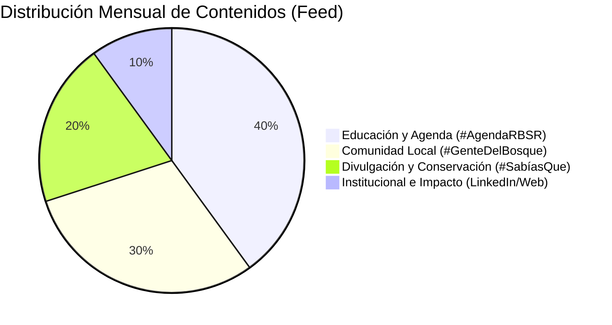

# Estrategia de Comunicación, Secciones Fijas y Planificación: RBSR

Este documento establece la matriz de contenidos estructurada en **7 ejes de trabajo estratégicos**, las **secciones fijas** que articulan el calendario editorial y el **checklist de calidad** para el flujo de trabajo diario de los técnicos de la **Reserva de la Biosfera Sierra del Rincón (RBSR)**.

---

## 1. Los 7 Ejes Estratégicos de Contenido

Para evitar centrar toda la comunicación únicamente en el turismo masivo del Hayedo, el calendario mensual debe equilibrarse entre los siguientes siete ejes temáticos definidos en el Plan Estratégico:

1.  **Agroalimentaria (Sector Primario y Tradición)**:
    *   *Foco*: Apoyo a productores locales, huertas tradicionales de judías, ganadería extensiva local, miel artesana, pan y queserías de la comarca.
    *   *Concepto*: Promover el producto de cercanía y las técnicas que cuidan el territorio.
2.  **Forestal y Conservación de la Naturaleza (Custodia del Territorio)**:
    *   *Foco*: Gestión forestal sostenible, reforestaciones, conservación de especies (flora y fauna protegida), geología singular de la Sierra.
    *   *Concepto*: Dar a conocer el valor ecológico del entorno para fomentar su protección activa.
3.  **Turismo Sostenible y Patrimonio (Ecoturismo Responsable)**:
    *   *Foco*: Senderismo interpretativo, visitas de bajo impacto, patrimonio histórico, arquitectura tradicional de piedra y pizarra, hostelería local responsable.
    *   *Concepto*: Atraer a un visitante respetuoso, consciente y que aporte valor económico local.
4.  **Emprendimiento Rural y Educación Ambiental (Aprendizaje y Futuro)**:
    *   *Foco*: Actividades del Centro de Educación Ambiental (CEA), cursos técnicos, talleres escolares, asesoramiento al emprendimiento sostenible.
    *   *Concepto*: Posicionar la sierra como un aula abierta al aprendizaje constante.
5.  **Trabajo y Empleo Local (Inclusión y Cuidados)**:
    *   *Foco*: Ofertas de empleo en la comarca, cooperativas locales, priorización de contratación de residentes de los seis municipios de la Reserva.
    *   *Concepto*: Visibilizar el impacto social y el arraigo poblacional en el medio rural.
6.  **Alianzas Institucionales y Gobernanza (Cooperación Viva)**:
    *   *Foco*: Colaboración con universidades, Comunidad de Madrid, ayuntamientos de la mancomunidad, Red de Reservas de la Biosfera (UNESCO MaB).
    *   *Concepto*: Mostrar el éxito del modelo de gestión compartida y la reputación científica.
7.  **Otros y Efemérides Ambientales (Concienciación Global)**:
    *   *Foco*: Día Internacional de las Montañas, Día Mundial del Agua, del Suelo, de la Biodiversidad, etc.
    *   *Concepto*: Conectar la Sierra del Rincón con las grandes metas de conservación planetarias.

---

## 2. Secciones Fijas del Calendario Editorial

El calendario mensual sugerido se articula a través de tres secciones fijas que dan coherencia, ritmo y reconocimiento a las publicaciones de la Reserva en redes sociales:

### A. `#AgendaRBSR` (Talleres, Sendas y Activaciones)
*   **Frecuencia**: Semanal (jueves o viernes).
*   **Canales**: Instagram, WhatsApp, Web.
*   **Contenido**: Difusión directa de las actividades gratuitas del CEA y sendas interpretativas organizadas. Requiere llamada a la acción clara e inmediata de reserva.

### B. `#SabíasQue` (Píldoras de Conservación y Curiosidades)
*   **Frecuencia**: Quincenal (martes o miércoles).
*   **Canales**: Instagram, Facebook, Web.
*   **Contenido**: Divulgación de datos curiosos e ilustrados. Ej: *"¿Sabías que el Hayedo de Montejo alberga carbajos centenarios que conviven con hayas en un microclima único?"* o explicaciones sencillas sobre la arquitectura de pizarra.

### C. `#GenteDelBosque` (Rostros, Oficios y Comunidad Local)
*   **Frecuencia**: Mensual.
*   **Canales**: Instagram, LinkedIn, Web (Reportaje extendido).
*   **Contenido**: Entrevistas breves y retratos de productores locales, apicultores, ganaderos, artesanos y técnicos de la Reserva. Pone en valor el "factor humano" que custodia el territorio.

---

## 3. Matriz de Distribución de Contenidos

Para mantener un canal dinámico y equilibrado, se sugiere la siguiente proporción de publicaciones mensuales en redes generales (feed de Instagram/Facebook):

---

## 4. Flujo de Trabajo y Checklist de Calidad (Antes de Publicar)

Antes de que un post, WhatsApp o entrada de blog salga a la luz, el técnico o redactor debe verificar obligatoriamente este checklist para garantizar el cumplimiento de los estándares de marca RBSR:

- [ ] **Alineamiento de Tono**: ¿El lenguaje suena cálido, humano y sensorial acorde con la estación de la sierra, o es frío y burocrático?
- [ ] **Coherencia Visual**: ¿La imagen es real del territorio o de sus gentes? (Queda terminantemente prohibido usar fotos de banco de stock artificiales).
- [ ] **Norma del Logotipo**: Si la imagen lleva el logo de la RBSR, ¿mantiene la proporción de aspecto, está situado sobre fondo liso y tiene el margen de seguridad de 1 cm libre de elementos?
- [ ] **Jerarquía de Logotipos**: Si es una colaboración institucional, ¿está el logo de la RBSR al mismo nivel horizontal e igual o menor tamaño visual que el escudo del ayuntamiento colaborador?
- [ ] **Datos Críticos**: ¿Están claros y visibles los datos de logística? (Fecha, Hora de encuentro, Municipio de la actividad, Duración, Destinatarios).
- [ ] **Llamada a la Acción (CTA)**: ¿Contiene un botón o enlace directo y limpio para realizar la reserva o inscripción?
- [ ] **Accesibilidad (ALT)**: ¿Se ha redactado y adjuntado el texto alternativo detallado que describe la imagen para personas con discapacidad visual?
- [ ] **Firma Institucional**: En el caso de notas de prensa, correos masivos oficiales o folletos, ¿se ha incluido el texto oficial MaB reglamentario al final en tamaño de letra secundario?
